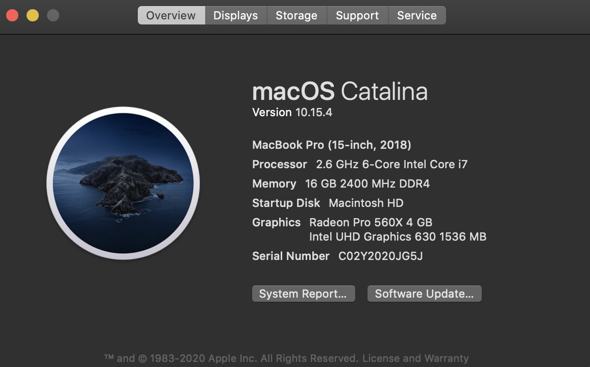
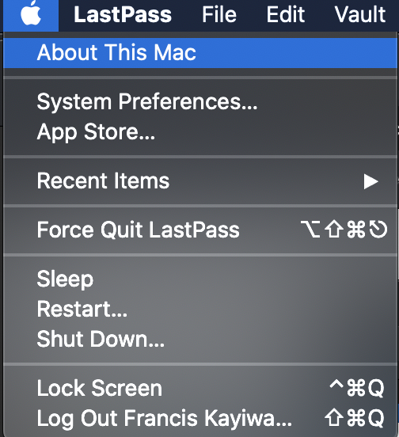

## On MacOS

If you intend to run Docnow on macOS

### Prerequisites

* At least 8GB memory
   * You can find this infomation this way 
* [Homebrew](https://brew.sh)
* Git (will be installed via Homebrew)
* Install [Docker](https://hub.docker.com/editions/community/docker-ce-desktop-mac) and [Docker compose](https://docs.docker.com/compose/install/)
* (optional) reverse proxy web server ideally with TLS. Your reverse proxy server will listen on port 3000 for the docnow application


### Installing Docnow

We strongly recommend using Docker for Mac not the Homebrew version. You can use the Homebrew installed Docker but sooner or later you are likely to spend a lot more time and hit some bumps. Before you do anything make sure your Docker Application is running.

Install git by launching your Terminal app which is under (`/Applications/Utilities`)

```bash
brew install git
```

To install Docnow from the repository, clone the repository locally:

```bash
git clone https://github.com/docnow/docnow.git
cd docnow
docker-compose up -d
```

Launch your preferred browser and open up: [http://localhost:3000](http://localhost:3000)